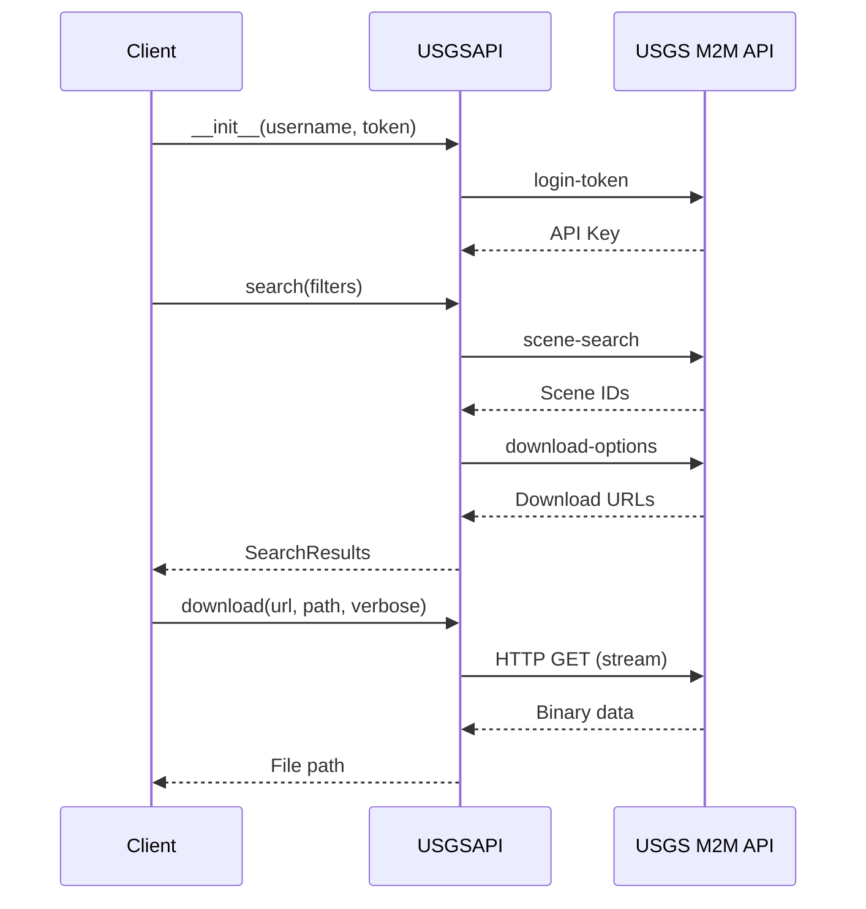

# USGS API (Earth Explorer)

## Overview

The `sat_download.api.usgs` module provides the `SatelliteAPI` implementation for the **USGS Earth Explorer** using the Machine-to-Machine (M2M) API, allowing searching and downloading of Landsat 8 images.

---

## API Reference

::: sat_download.api.usgs.USGSAPI
    options:
      show_root_heading: true
      show_source: true
      members:
        - __init__
        - search
        - download

---

## Endpoints

| Constant | Value | Description |
|----------|-------|-------------|
| `API_URL` | `https://m2m.cr.usgs.gov/api/api/json/stable/` | Base API URL |
| `LOGIN_ENDPOINT` | `login-token` | Authentication endpoint |
| `SEARCH_ENDPOINT` | `scene-search` | Scene search endpoint |
| `DOWNLOAD_REQUEST_ENDPOINT` | `download-request` | Download request endpoint |
| `DOWNLOAD_OPTIONS_ENDPOINT` | `download-options` | Download options endpoint |

---

## Supported Filters

| Filter | Type | Description | Example |
|--------|------|-------------|---------|
| `collection` | `str` | Satellite collection | `"landsat_ot_c2_l1"` |
| `start_date` | `str` | Start date (YYYY-MM-DD) | `"2024-01-01"` |
| `end_date` | `str` | End date (YYYY-MM-DD) | `"2024-01-31"` |
| `processing_level` | `str` | Processing tier | `"T1"` |
| `geometry` | `str` | WKT geometry | `"POINT(-100 40)"` |
| `tile_id` | `str` | Path/Row identifier | `"203033"` |

---

## Usage Examples

### Basic Search

```python
from sat_download.api.usgs import USGSAPI
from sat_download.data_types.search import SearchFilters
from sat_download.enums import COLLECTIONS

# IMPORTANT: password must be an API Token, not your password
api = USGSAPI(
    username="your_username",
    password="your_api_token_here"
)

filters = SearchFilters(
    collection=COLLECTIONS.LANDSAT_8.value,
    processing_level="T1",
    start_date="2024-01-01",
    end_date="2024-01-31",
    tile_id="203033"
)

results = api.search(filters)

for download_url, image in results.items():
    print(f"{image.date}: {image.filename}")
```

### Search by Geometry

```python
# Search by point
filters = SearchFilters(
    collection=COLLECTIONS.LANDSAT_8.value,
    start_date="2024-01-01",
    end_date="2024-01-31",
    geometry="POINT(-100.0 40.0)"
)

results = api.search(filters)
```

### Download Images

```python
# Search for images
results = api.search(filters)

# Download all images
for download_url, image in results.items():
    filepath = api.download(
        image_id=download_url,
        outname=f"./images/{image.filename}",
        verbose=1
    )
    
    if filepath:
        print(f"Downloaded: {filepath}")
```

---

## Authentication

!!! warning "Important: Use API Token"
    The `password` parameter must be an **API Token**, not your user password.

### Obtaining API Token

1. Go to [https://ers.cr.usgs.gov/](https://ers.cr.usgs.gov/)
2. Log in with your credentials
3. Go to **My Profile** → **Access**
4. Click **Generate Application Token**
5. Copy the token and use it as the `password` parameter

```python
# Correct usage
api = USGSAPI(
    username="your_username",
    password="your_api_token_here"  # NOT your password!
)
```

---

## Search Results

!!! note "Keys are Download URLs"
    Unlike `ODataAPI`, the `SearchResults` dictionary keys are **direct download URLs**, not product IDs.

```python
results = api.search(filters)

for download_url, image in results.items():
    # download_url is the direct URL to download
    # image is SatelliteImage with metadata
    print(f"URL: {download_url}")
    print(f"File: {image.filename}")
```

---

## M2M API Flow



---

## Landsat Collections

| Collection ID | Satellite | Description |
|---------------|-----------|-------------|
| `landsat_ot_c2_l1` | Landsat 8/9 | Collection 2 Level-1 |
| `landsat_ot_c2_l2` | Landsat 8/9 | Collection 2 Level-2 |
| `landsat_etm_c2_l1` | Landsat 7 | ETM+ Collection 2 Level-1 |
| `landsat_tm_c2_l1` | Landsat 4/5 | TM Collection 2 Level-1 |

---

## References

- [USGS Earth Explorer](https://earthexplorer.usgs.gov/)
- [M2M API Documentation](https://m2m.cr.usgs.gov/)
- [Landsat Collections](https://www.usgs.gov/landsat-missions/landsat-collection-2)
- [Base API](base.md)
