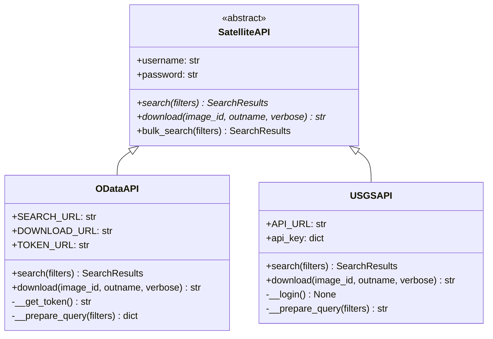
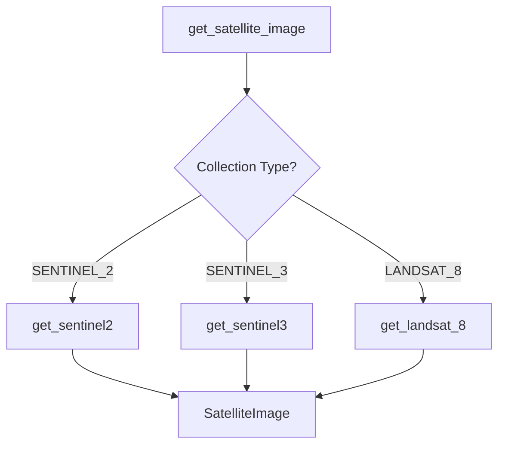
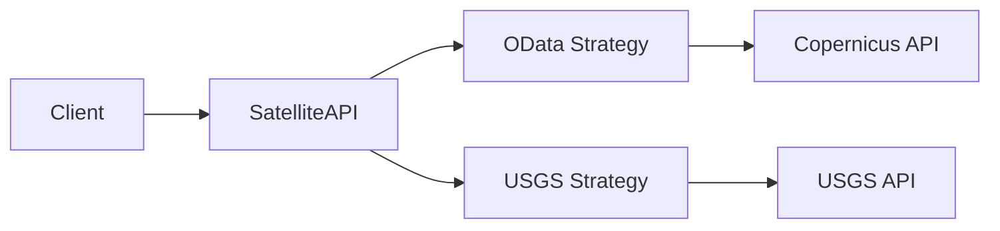
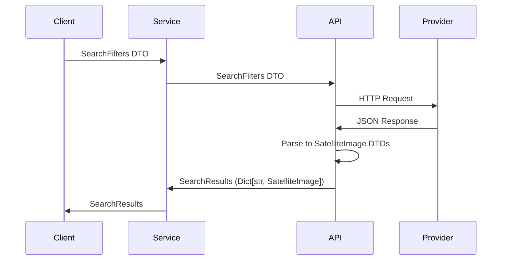
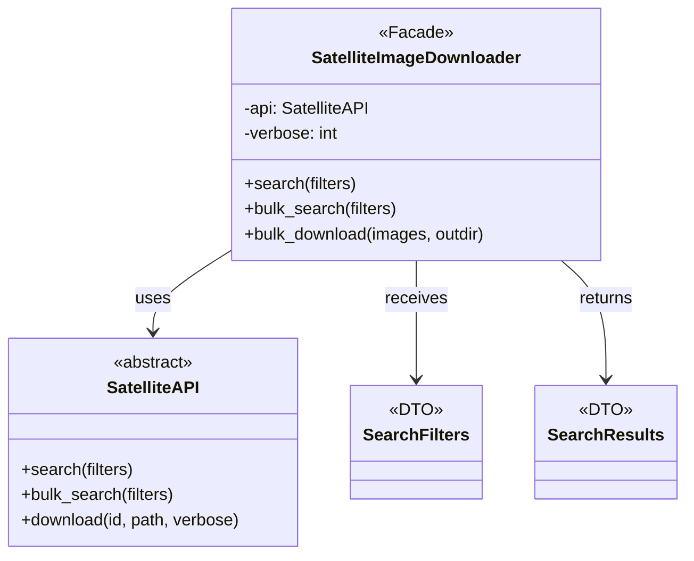
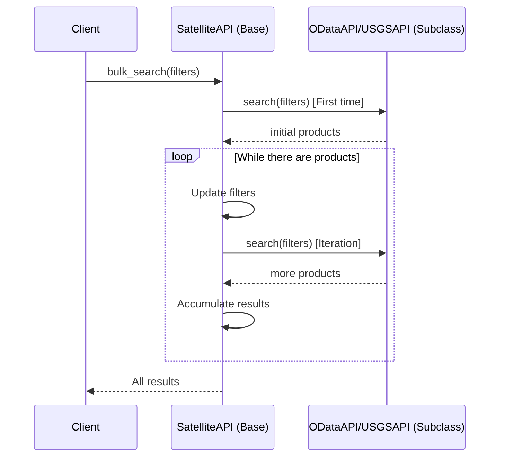
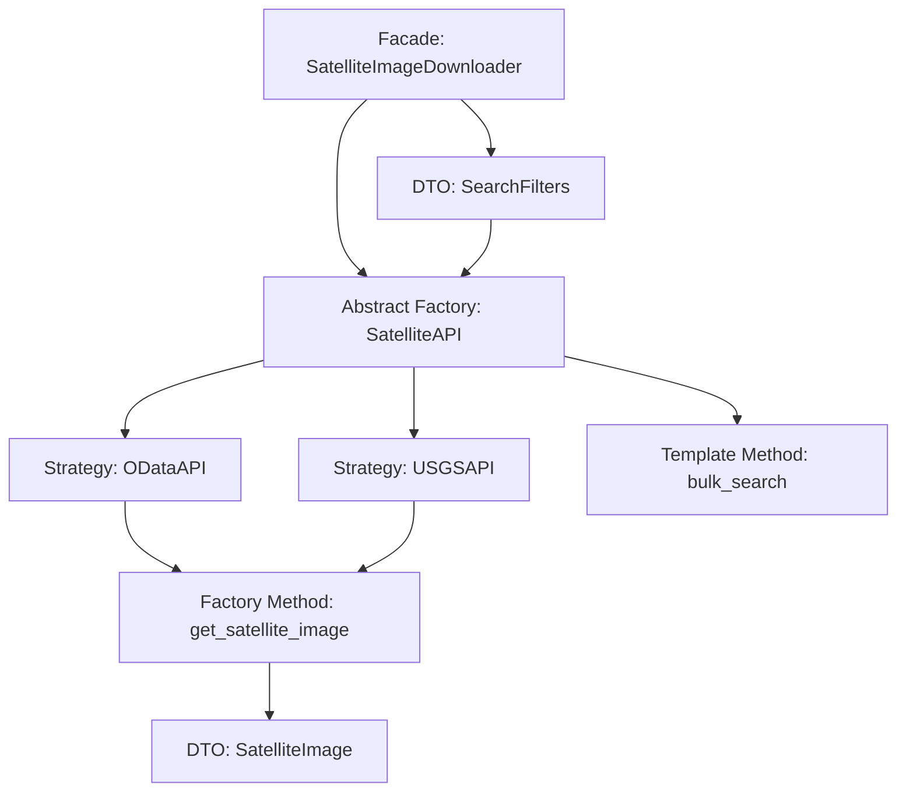

# Design Patterns

This document describes the design patterns implemented in **Remote Sensing Satellite Downloader**, explaining their purpose, implementation, and benefits.

---

## 1. Abstract Factory Pattern

### Description
The Abstract Factory pattern provides an interface for creating families of related objects without specifying their concrete classes.

### Implementation in the Project

#### Abstract Class: `SatelliteAPI`
**Location**: `sat_download/api/base.py`

```python
from abc import ABC, abstractmethod

class SatelliteAPI(ABC):
    """Abstract base class for satellite API clients."""
    
    def __init__(self, username: str, password: str) -> None:
        self.username = username
        self.password = password

    @abstractmethod
    def search(self, filters: SearchFilters) -> SearchResults:
        """Search for satellite images."""
        pass

    @abstractmethod
    def download(self, image_id: str, outname: str, verbose: int) -> str | None:
        """Download satellite images."""
        pass
    
    def bulk_search(self, filters: SearchFilters) -> SearchResults:
        """Concrete implementation of bulk search."""
        # Shared logic between all implementations
        pass
```

#### Concrete Implementations

**ODataAPI** - For Copernicus Data Space:
```python
class ODataAPI(SatelliteAPI):
    SEARCH_URL = "https://catalogue.dataspace.copernicus.eu/odata/v1/Products"
    DOWNLOAD_URL = "https://download.dataspace.copernicus.eu/odata/v1/Products"
    
    def search(self, filters: SearchFilters) -> SearchResults:
        # Specific implementation for OData
        pass
    
    def download(self, image_id: str, outname: str, verbose: int) -> str | None:
        # Specific implementation for Copernicus
        pass
```

**USGSAPI** - For USGS Earth Explorer:
```python
class USGSAPI(SatelliteAPI):
    API_URL = "https://m2m.cr.usgs.gov/api/api/json/stable/"
    
    def search(self, filters: SearchFilters) -> SearchResults:
        # Specific implementation for USGS M2M
        pass
    
    def download(self, image_id: str, outname: str, verbose: int) -> str | None:
        # Specific implementation for USGS
        pass
```

### UML Diagram



### Benefits

✅ **Interchangeability**: Can switch between providers without modifying client code

✅ **Extensibility**: Adding new providers is easy, just implement the interface

✅ **Maintainability**: Each provider has its own isolated implementation

✅ **Polymorphism**: Client code works with the abstraction, not concrete implementations

### Usage Example

```python
# Client code doesn't need to know which concrete implementation is being used
def download_images(api: SatelliteAPI, filters: SearchFilters):
    results = api.search(filters)
    for image_id, image in results.items():
        api.download(image_id, f"./{image.filename}", verbose=1)

# Implementations can be easily interchanged
api_copernicus = ODataAPI(username="user", password="pass")
api_usgs = USGSAPI(username="user", password="token")

# Same code, different implementations
download_images(api_copernicus, filters)  # Uses Copernicus
download_images(api_usgs, filters)         # Uses USGS
```

---

## 2. Factory Method Pattern

### Description
The Factory Method pattern defines an interface for creating objects, but allows subclasses to decide which class to instantiate.

### Implementation in the Project

#### Factory Function: `get_satellite_image()`
**Location**: `sat_download/factories/search.py`

```python
def get_satellite_image(collection: COLLECTIONS, data: dict) -> SatelliteImage:
    """
    Factory function that creates SatelliteImage based on collection type.
    """
    if collection == COLLECTIONS.SENTINEL_2:
        result = get_sentinel2(collection.value, data['Name'])
    elif collection == COLLECTIONS.SENTINEL_3:
        result = get_sentinel3(collection.value, data['Name'])
    elif collection == COLLECTIONS.LANDSAT_8:
        result = get_landsat_8('Landsat-8', data['Name'])
    
    return result
```

#### Specialized Creation Methods

**Parser for Sentinel-2**:
```python
def get_sentinel2(satellite: str, name: str) -> SatelliteImage:
    """Extracts metadata from Sentinel-2 name format."""
    components = name.split('_')
    date = components[2].split('T')[0]
    brother = components[0][-1]
    uuid = f"{date}_{components[0]}"
    tile = components[-2][1:]
    
    return SatelliteImage(
        uuid=uuid, date=date, sensor=satellite,
        brother=brother, identifier=f"{satellite}{brother}",
        tile=tile, filename=f"{name.split('.')[0]}.zip"
    )
```

**Parser for Landsat 8**:
```python
def get_landsat_8(satellite: str, name: str) -> SatelliteImage:
    """Extracts metadata from Landsat 8 name format."""
    components = name.split('_')
    date = components[3]
    brother = components[0][-1]
    uuid = f"{date}_{components[0]}"
    tile = f"{components[2]}{components[3]}"
    
    return SatelliteImage(
        uuid=uuid, date=date, sensor=satellite,
        brother=brother, identifier=f"{satellite}{brother}",
        tile=tile, filename=f"{name}.tar"
    )
```

### Flow Diagram



### Benefits

✅ **Encapsulation**: Complex creation logic is encapsulated in specialized functions

✅ **Maintainability**: Each satellite type has its own parser

✅ **Extensibility**: Adding support for new satellites only requires a new parser function

✅ **Single Responsibility**: Each function has a single responsibility

---

## 3. Strategy Pattern

### Description
The Strategy pattern defines a family of algorithms, encapsulates them, and makes them interchangeable.

### Implementation in the Project

Each implementation of `SatelliteAPI` represents a different strategy for:
- **Authentication** (OAuth2 vs API Token)
- **Query Construction** (OData vs REST JSON)
- **File Download** (Direct URLs vs download requests)

#### OData Strategy (Copernicus)

```python
class ODataAPI(SatelliteAPI):
    def __get_token(self) -> str:
        """OAuth2 authentication strategy."""
        data = {
            "client_id": "cdse-public",
            "username": self.username,
            "password": self.password,
            "grant_type": "password",
        }
        response = requests.post(self.TOKEN_URL, data=data)
        return response.json()["access_token"]
    
    def __prepare_query(self, filters: SearchFilters) -> dict:
        """OData query construction strategy."""
        params = []
        if filters.is_set('collection'):
            params.append(f"Collection/Name eq '{filters.collection}'")
        if filters.is_set('geometry'):
            params.append(f"OData.CSC.Intersects(area=geography'SRID=4326;{filters.geometry}')")
        return {"$filter": ' and '.join(params)}
```

#### USGS Strategy (Earth Explorer)

```python
class USGSAPI(SatelliteAPI):
    def __login(self):
        """API Token authentication strategy."""
        payload = {'username': self.username, 'token': self.password}
        response = requests.post(f'{self.API_URL}{self.LOGIN_ENDPOINT}', 
                                json.dumps(payload))
        self.api_key = {'X-Auth-Token': response.json()['data']}
    
    def __prepare_query(self, filters: SearchFilters) -> str:
        """JSON REST query construction strategy."""
        query = {
            "datasetName": filters.collection,
            "sceneFilter": {
                "acquisitionFilter": {
                    "start": filters.start_date,
                    "end": filters.end_date
                }
            }
        }
        return json.dumps(query)
```

### Context Diagram



### Benefits

✅ **Flexibility**: Strategy can be changed at runtime

✅ **Isolation**: Each strategy is isolated from others

✅ **Testability**: Each strategy can be tested independently

---

## 4. Data Transfer Object (DTO) Pattern

### Description
The DTO pattern encapsulates data for transfer between subsystems, reducing the number of method calls.

### Implementation in the Project

#### `SearchFilters` DTO
**Location**: `sat_download/data_types/search.py`

```python
@dataclass
class SearchFilters:
    """DTO to encapsulate search criteria."""
    collection: str
    start_date: str
    end_date: str
    processing_level: str | None = None
    geometry: str | None = None
    tile_id: str | None = None
    contains: List[str] | None = None
    
    def is_set(self, value: str) -> bool:
        """Checks if a field is set."""
        return hasattr(self, value) and getattr(self, value) is not None
```

#### `SatelliteImage` DTO

```python
@dataclass
class SatelliteImage:
    """DTO to encapsulate satellite image metadata."""
    uuid: str
    date: str
    sensor: str
    brother: str
    identifier: str
    filename: str
    tile: str
```

### Type Alias para Resultados

```python
SearchResults = Dict[str, SatelliteImage]
```

### Transfer Diagram



### Benefits

✅ **Immutability**: Use of `@dataclass` for immutable data structures

✅ **Type Safety**: Type hints for error prevention

✅ **Serialization**: Easy conversion between formats

✅ **Validation**: Helper methods like `is_set()` for validation

---

## 5. Facade Pattern

### Description
The Facade pattern provides a simplified interface to a complex subsystem.

### Implementation in the Project

#### Facade Class: `SatelliteImageDownloader`
**Location**: `sat_download/services/downloader.py`

```python
class SatelliteImageDownloader:
    """
    Facade that simplifies search and download operations.
    Hides the complexity of working directly with APIs.
    """
    
    def __init__(self, api: SatelliteAPI, verbose=0) -> None:
        self.api = api
        self.verbose = verbose
    
    def search(self, filters: SearchFilters) -> SearchResults:
        """Simple search with error handling."""
        try:
            return self.api.search(filters)
        except Exception as exc:
            print(exc)
    
    def bulk_search(self, filters: SearchFilters) -> SearchResults:
        """Simplified bulk search."""
        try:
            return self.api.bulk_search(filters)
        except Exception as exc:
            print(exc)
    
    def bulk_download(self, images: SearchResults, outdir: str) -> List[str | None]:
        """Bulk download with automatic directory creation."""
        try:
            os.makedirs(outdir, exist_ok=True)
            return [
                self.api.download(download_id, os.path.join(outdir, image.filename), self.verbose)
                for download_id, image in images.items()
            ]
        except Exception as exc:
            print(exc)
```

### Comparison: With and Without Facade

**Without Facade (Complex)**:
```python
# User must handle many details
api = ODataAPI(username, password)
filters = SearchFilters(...)

try:
    results = api.search(filters)
except Exception as e:
    print(e)

os.makedirs("./images", exist_ok=True)
for image_id, image in results.items():
    try:
        filepath = os.path.join("./images", image.filename)
        api.download(image_id, filepath, verbose=1)
    except Exception as e:
        print(e)
```

**With Facade (Simple)**:
```python
# Simplified interface
api = ODataAPI(username, password)
downloader = SatelliteImageDownloader(api, verbose=1)

filters = SearchFilters(...)
results = downloader.search(filters)
downloader.bulk_download(results, "./images")
```

### Structure Diagram



### Benefits

✅ **Simplicity**: Simpler interface for common operations

✅ **Error Handling**: Centralized exception management

✅ **Convenience**: Operations like creating directories are automated

✅ **Decoupling**: Client doesn't need to know internal complexity

---

## 6. Template Method Pattern

### Description
The Template Method pattern defines the skeleton of an algorithm in an operation, delegating some steps to subclasses.

### Implementation in the Project

#### Template Method: `bulk_search()`
**Location**: `sat_download/api/base.py`

```python
class SatelliteAPI(ABC):
    def bulk_search(self, filters: SearchFilters) -> SearchResults:
        """
        Template Method: Defines the iterative search algorithm.
        Subclasses implement search() but reuse this logic.
        """
        last_filters = None
        end = datetime.strptime(filters.end_date, '%Y-%m-%d')
        results: SearchResults = {}
        
        # Step 1: First search (delegated to subclasses)
        products: SearchResults = self.search(filters)
        
        # Steps 2-4: Common logic for all implementations
        while bool(products) and last_filters != filters:
            last_filters = deepcopy(filters)
            
            # Update date range based on results
            for product in products.values():
                date = datetime.strptime(product.date, '%Y%m%d')
                if date < end:
                    end = date
            
            results.update(products)
            filters.end_date = end.strftime('%Y-%m-%d')
            
            # Iterative search (delegated to subclasses)
            products = self.search(filters)
        
        return results
    
    @abstractmethod
    def search(self, filters: SearchFilters) -> SearchResults:
        """Abstract step that subclasses must implement."""
        pass
```

### Sequence Diagram



### Benefits

✅ **Reusability**: Common logic in base class, variations in subclasses

✅ **Consistency**: All implementations follow the same general algorithm

✅ **Maintainability**: Changes to the general algorithm are made in one place only

---

## Pattern Summary

| Pattern | Location | Purpose |
|---------|----------|---------|
| **Abstract Factory** | `api/base.py`, `api/odata.py`, `api/usgs.py` | Abstraction of different API providers |
| **Factory Method** | `factories/search.py` | Creation of `SatelliteImage` objects by collection |
| **Strategy** | `api/odata.py`, `api/usgs.py` | Different authentication and query algorithms |
| **Data Transfer Object** | `data_types/search.py` | Data transfer between layers |
| **Facade** | `services/downloader.py` | Simplified interface for complex operations |
| **Template Method** | `api/base.py:bulk_search()` | Iterative search algorithm with variable steps |

---

## Pattern Interaction



The patterns work together to create an architecture that is:
- **Flexible**: Easy to extend with new providers
- **Maintainable**: Clearly separated responsibilities
- **Testable**: Decoupled and well-defined components
- **Usable**: Simple interface for the end user
