# Architecture Diagrams

This document contains visual diagrams that illustrate the architecture and data flows of the project.

---

## Class Diagram: API Layer

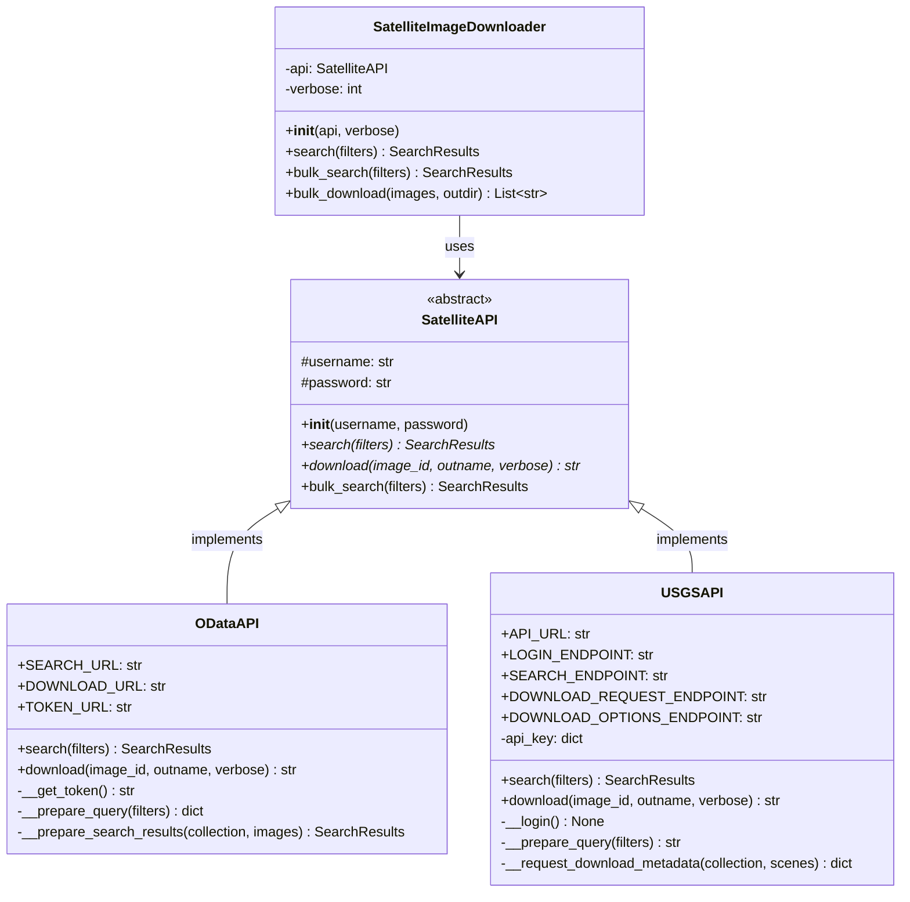

---

## Class Diagram: Data Types

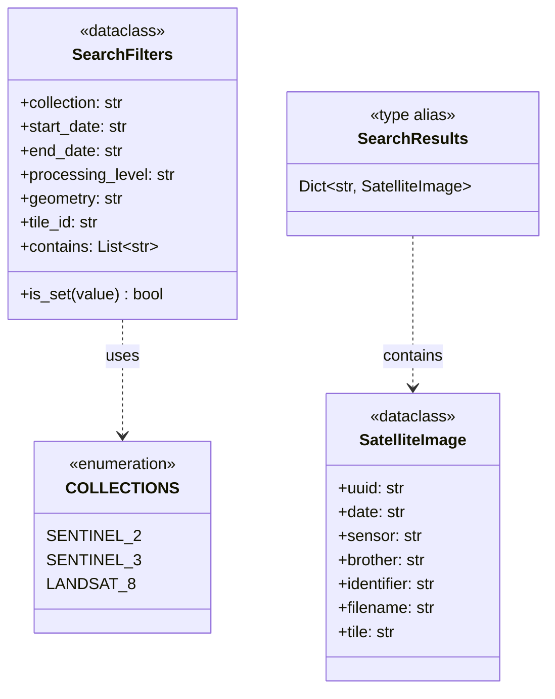

---

## Component Diagram: Request Flow

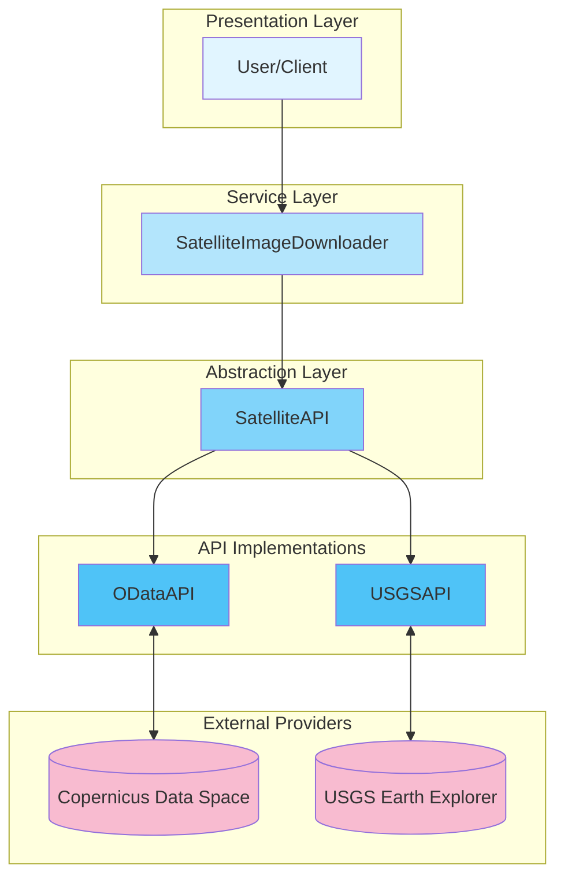

---

## Component Diagram: Data & Factories

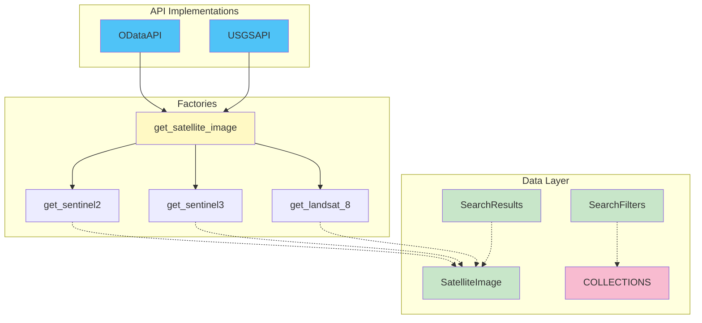

---

## Image Search Flow

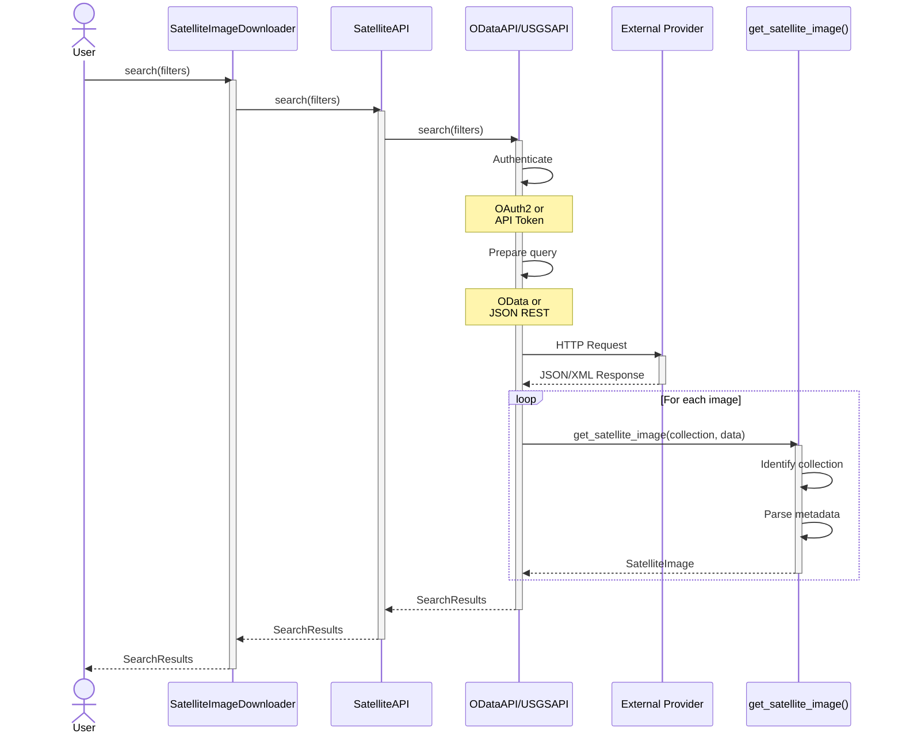

---

## Image Download Flow

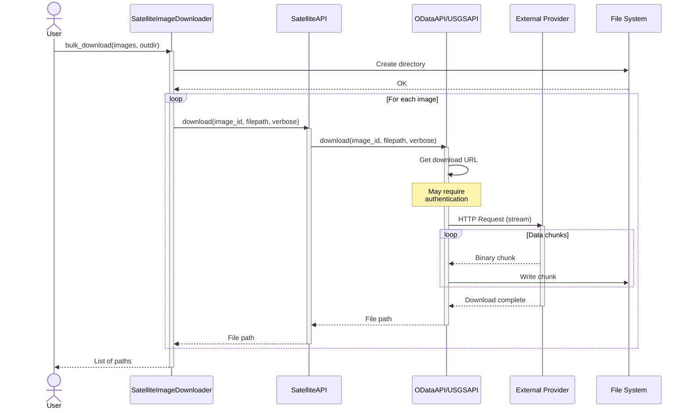

---

## Bulk Search Flow (bulk_search)

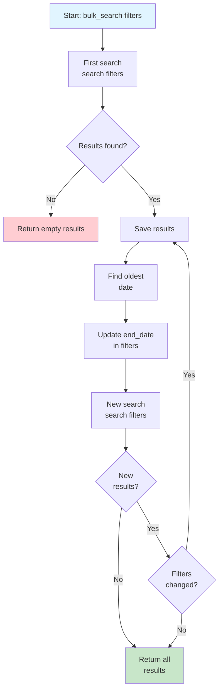

**Algorithm Explanation**:

1. **First search**: Executed with original filters
2. **Iteration**: For each set of results:
   - Extract the oldest date
   - Update `end_date` to that date
   - Search again with the reduced range
3. **Termination**: The loop ends when:
   - No more results
   - Filters don't change (same date)

This approach allows handling large date ranges that might exceed API limits.

---

## Package Diagram

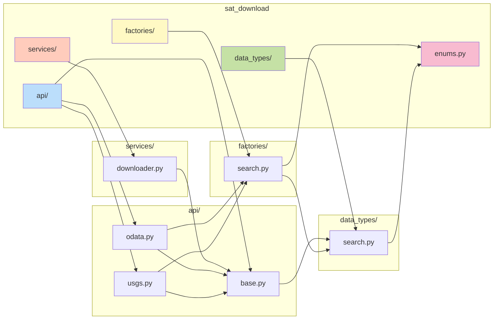

## State Diagram: Download Process

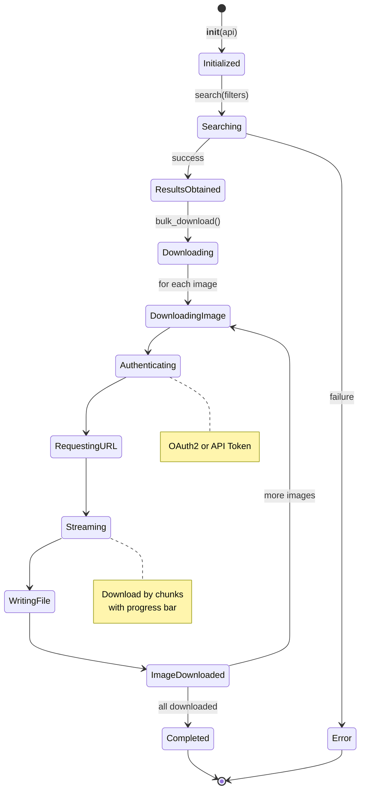

---

## Activity Diagram: Complete Flow

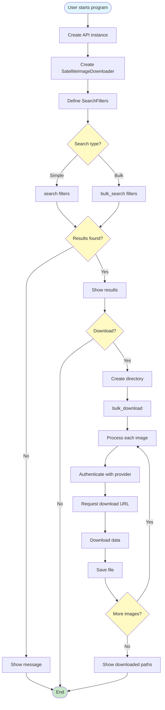

---

## Pattern Interaction Diagram

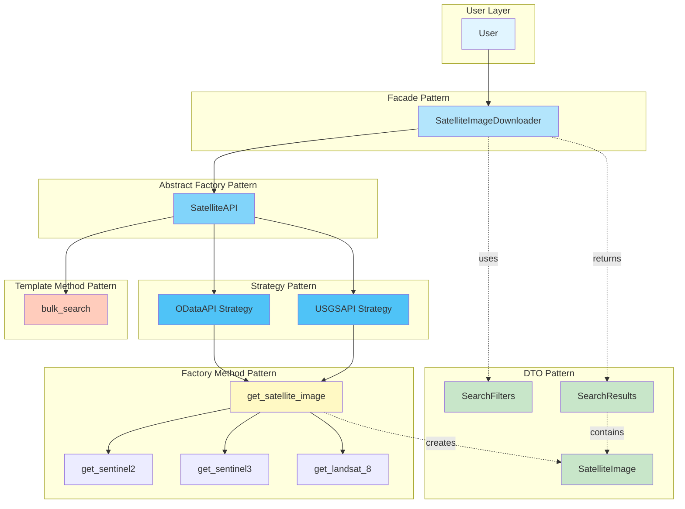

---

## Summary

These diagrams provide different views of the architecture:

- **Class Diagrams**: Static structure and relationships
- **Component Diagrams**: Modular organization
- **Sequence Diagrams**: Interactions between objects
- **Flow Diagrams**: Process logic
- **State Diagrams**: Object lifecycle
- **Activity Diagrams**: Complete workflows
- **Package Diagrams**: Dependencies between modules

All these diagrams are automatically rendered by MkDocs using Mermaid.js when the documentation is built.
