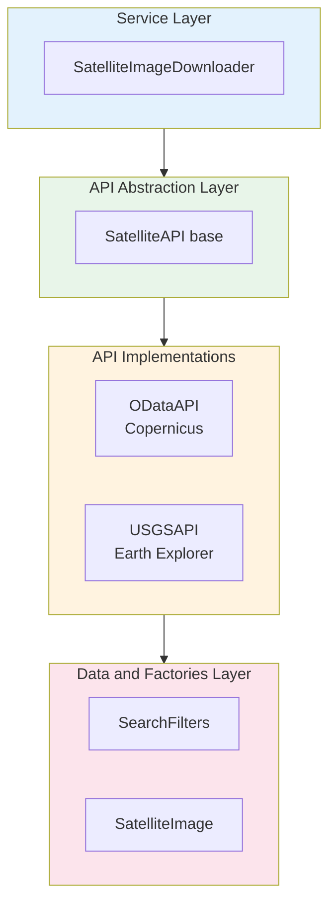
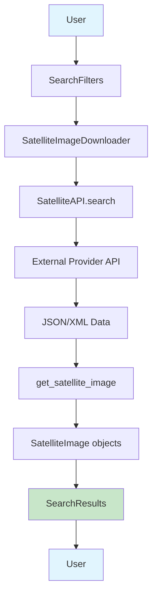
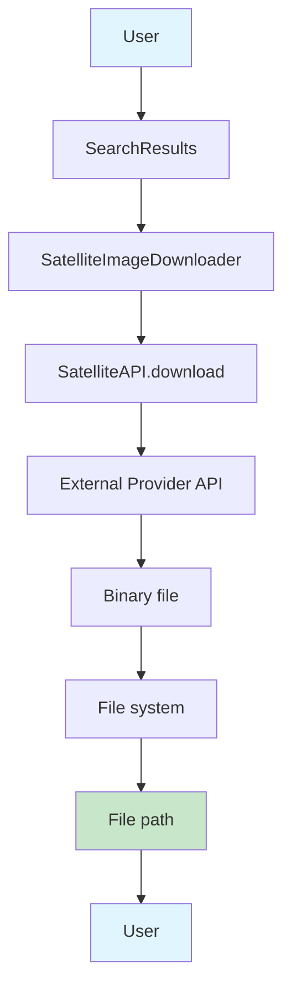

# Architecture Overview

## Introduction

**Remote Sensing Satellite Downloader** is designed with a modular and extensible architecture that allows easy integration of new satellite data providers while maintaining a consistent interface.

## Design Principles

### 1. Separation of Concerns
Each module has a clearly defined responsibility:

- **API**: Management of communication with external providers
- **Data Types**: Shared data structures
- **Factories**: Creation of complex objects
- **Services**: High-level business logic

### 2. Abstraction
Abstract interfaces allow working with different providers without changing client code.

### 3. Extensibility
Adding a new provider only requires implementing the `SatelliteAPI` abstract class.

## Layered Architecture



## Main Components

### 1. API Module (`sat_download.api`)

#### `base.SatelliteAPI` (Abstract Class)
Defines the contract that all API implementations must fulfill:

- **Abstract methods**:
    - `search(filters)`: Image search
    - `download(image_id, outname, verbose)`: Image download

- **Concrete methods**:
    - `bulk_search(filters)`: Iterative search for large date ranges

#### Concrete Implementations

**`odata.ODataAPI`**
- Implementation for Copernicus Data Space Ecosystem
- Supports Sentinel-2 and Sentinel-3
- Uses OAuth2 authentication with Keycloak
- OData queries for search

**`usgs.USGSAPI`**
- Implementation for USGS Earth Explorer
- Supports Landsat 8
- Uses API tokens for authentication
- M2M (Machine-to-Machine) REST API

### 2. Data Types Module (`sat_download.data_types`)

#### `search.SatelliteImage`
Dataclass representing satellite image metadata:
```python
@dataclass
class SatelliteImage:
    uuid: str
    date: str
    sensor: str
    brother: str
    identifier: str
    filename: str
    tile: str
```

#### `search.SearchFilters`
Dataclass for specifying search criteria:
```python
@dataclass
class SearchFilters:
    collection: str
    start_date: str
    end_date: str
    processing_level: str | None
    geometry: str | None
    tile_id: str | None
    contains: List[str] | None
```

### 3. Factories Module (`sat_download.factories`)

#### `search.get_satellite_image()`
Factory function that creates `SatelliteImage` objects from raw API data.

Specialized parsers:
- `get_sentinel2()`: Extracts metadata from Sentinel-2 filenames
- `get_sentinel3()`: Extracts metadata from Sentinel-3 filenames
- `get_landsat_8()`: Extracts metadata from Landsat 8 filenames

### 4. Services Module (`sat_download.services`)

#### `downloader.SatelliteImageDownloader`
High-level service that provides a simplified interface:

```python
class SatelliteImageDownloader:
    def __init__(self, api: SatelliteAPI, verbose=0)
    def search(self, filters: SearchFilters) -> SearchResults
    def bulk_search(self, filters: SearchFilters) -> SearchResults
    def bulk_download(self, images: SearchResults, outdir: str) -> List[str | None]
```

### 5. Enumerations (`sat_download.enums`)

#### `COLLECTIONS`
Defines supported satellite collections:
```python
class COLLECTIONS(Enum):
    SENTINEL_2 = 'SENTINEL-2'
    SENTINEL_3 = 'SENTINEL-3'
    LANDSAT_8 = 'landsat_ot_c2_l1'
```

## Data Flow

### Image Search



### Image Download



## Error Handling

- **Try-Catch in Services**: `SatelliteImageDownloader` methods capture exceptions and print them
- **Validation in APIs**: API implementations validate responses and throw descriptive exceptions
- **Robust Authentication**: Token and credential handling with clear error messages

## Extensibility

### Adding a New Provider

1. **Create new class** inheriting from `SatelliteAPI`:
```python
class NewProviderAPI(SatelliteAPI):
    def search(self, filters: SearchFilters) -> SearchResults:
        # Implement search
        pass
    
    def download(self, image_id: str, outname: str, verbose: int) -> str | None:
        # Implement download
        pass
```

2. **Add parser** in `factories/search.py`:
```python
def get_new_provider(satellite: str, name: str) -> SatelliteImage:
    # Extract metadata from specific format
    pass
```

3. **Update enumeration** in `enums.py`:
```python
class COLLECTIONS(Enum):
    NEW_COLLECTION = 'new_collection_id'
```

4. **Update factory function**:
```python
def get_satellite_image(collection: COLLECTIONS, data: dict) -> SatelliteImage:
    if collection == COLLECTIONS.NEW_COLLECTION:
        result = get_new_provider(collection.value, data['Name'])
    # ...
```

## Performance Considerations

- **Iterative Search**: `bulk_search()` divides large date ranges into smaller queries
- **Download with Progress Bar**: Use of `tqdm` for visual feedback
- **File Streaming**: Download in chunks to handle large files
- **Session Reuse**: Persistent authentication during the session

## Main Dependencies

- **requests**: HTTP communication with APIs
- **tqdm**: Progress bars
- **dataclasses**: Immutable data structures
- **abc**: Abstract classes
- **typing**: Type hints for better maintainability
