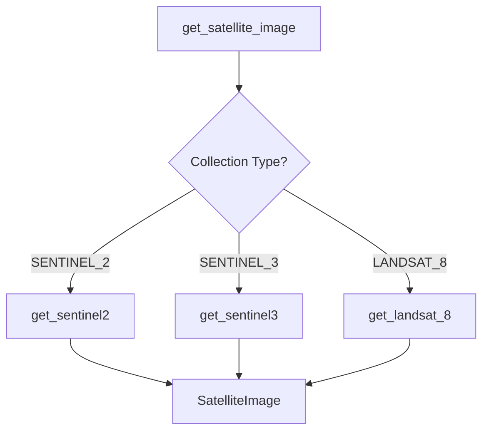

# Search Factory

## Overview

The `sat_download.factories.search` module provides factory functions for creating `SatelliteImage` objects from raw API response data.

---

## API Reference

### Main Factory

::: sat_download.factories.search.get_satellite_image
    options:
      show_root_heading: true
      show_source: true

---

### Specialized Parsers

::: sat_download.factories.search.get_sentinel2
    options:
      show_root_heading: true
      show_source: true

::: sat_download.factories.search.get_sentinel3
    options:
      show_root_heading: true
      show_source: true

::: sat_download.factories.search.get_landsat_8
    options:
      show_root_heading: true
      show_source: true

---

## Factory Flow



---

## Usage Examples

### Basic Usage

```python
from sat_download.factories.search import get_satellite_image
from sat_download.enums import COLLECTIONS

# Sentinel-2 data from API response
api_data = {
    'Name': 'S2A_MSIL2A_20240115T105421_N0510_R051_T30TWM_20240115T142543.SAFE'
}

# Create SatelliteImage object
image = get_satellite_image(COLLECTIONS.SENTINEL_2, api_data)

print(f"Date: {image.date}")       # 20240115
print(f"Tile: {image.tile}")       # 30TWM
print(f"Sensor: {image.sensor}")   # Sentinel-2
print(f"File: {image.filename}")   # S2A_MSIL2A_20240115T105421_N0510_R051_T30TWM_20240115T142543.zip
```

### Landsat 8 Example

```python
from sat_download.factories.search import get_satellite_image
from sat_download.enums import COLLECTIONS

# Landsat 8 data from API response
api_data = {
    'Name': 'LC08_L1TP_203033_20240115_20240125_02_T1'
}

# Create SatelliteImage object
image = get_satellite_image(COLLECTIONS.LANDSAT_8, api_data)

print(f"Date: {image.date}")       # 20240115
print(f"Tile: {image.tile}")       # 20303320240115
print(f"Sensor: {image.sensor}")   # Landsat-8
print(f"File: {image.filename}")   # LC08_L1TP_203033_20240115_20240125_02_T1.tar
```

---

## Filename Formats

### Sentinel-2 Format

```
S2A_MSIL2A_20240115T105421_N0510_R051_T30TWM_20240115T142543.SAFE
│   │      │               │     │    │      │
│   │      │               │     │    │      └─ Processing timestamp
│   │      │               │     │    └─ Tile ID (T30TWM)
│   │      │               │     └─ Relative orbit
│   │      │               └─ Processing baseline
│   │      └─ Acquisition date/time
│   └─ Product type (MSIL2A)
└─ Satellite (S2A = Sentinel-2A)
```

### Landsat 8 Format

```
LC08_L1TP_203033_20240115_20240125_02_T1
│    │    │      │        │        │  │
│    │    │      │        │        │  └─ Collection tier (T1)
│    │    │      │        │        └─ Collection number
│    │    │      │        └─ Processing date
│    │    │      └─ Acquisition date
│    │    └─ Path/Row (203/033)
│    └─ Product type (L1TP)
└─ Satellite (LC08 = Landsat 8)
```

---

## Adding New Satellite Support

To add support for a new satellite, create a parser function:

```python
def get_new_satellite(satellite: str, name: str) -> SatelliteImage:
    """
    Parse metadata from new satellite filename format.
    
    Parameters
    ----------
    satellite : str
        The satellite platform name
    name : str
        The original filename
        
    Returns
    -------
    SatelliteImage
        Standardized satellite image object
    """
    # Parse filename components
    components = name.split('_')
    
    # Extract metadata
    date = components[DATE_POSITION]
    brother = components[SATELLITE_POSITION][-1]
    uuid = f"{date}_{components[SATELLITE_POSITION]}"
    tile = components[TILE_POSITION]
    
    return SatelliteImage(
        uuid=uuid,
        date=date,
        sensor=satellite,
        brother=brother,
        identifier=f"{satellite}{brother}",
        tile=tile,
        filename=f"{name}.zip"
    )
```

Then update `get_satellite_image()`:

```python
def get_satellite_image(collection: COLLECTIONS, data: dict) -> SatelliteImage:
    if collection == COLLECTIONS.NEW_SATELLITE:
        result = get_new_satellite(collection.value, data['Name'])
    # ... existing cases
    return result
```

---

## Design Pattern

This module implements the **Factory Method Pattern**:

- `get_satellite_image()` is the factory method
- Specialized parsers handle collection-specific logic
- All return the same `SatelliteImage` type

See: [Design Patterns](../architecture/design-patterns.md#2-factory-method-pattern)

---

## References

- [SatelliteImage](../data-types/search.md#satelliteimage) - Output data type
- [COLLECTIONS](../data-types/enums.md) - Collection identifiers
- [Sentinel-2 Naming Convention](https://sentinel.esa.int/web/sentinel/user-guides/sentinel-2-msi/naming-convention)
- [Landsat Naming Convention](https://www.usgs.gov/faqs/what-naming-convention-landsat-collections-level-1-scenes)
