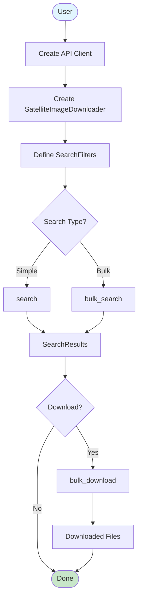

# Downloader Service

## Overview

The `sat_download.services.downloader` module provides a high-level facade for searching and downloading satellite images.

---

## API Reference

::: sat_download.services.downloader.SatelliteImageDownloader
    options:
      show_root_heading: true
      show_source: true
      members:
        - __init__
        - search
        - bulk_search
        - bulk_download

---

## Usage Examples

### Basic Workflow

```python
from sat_download.api.odata import ODataAPI
from sat_download.services.downloader import SatelliteImageDownloader
from sat_download.data_types.search import SearchFilters
from sat_download.enums import COLLECTIONS

# 1. Create API client
api = ODataAPI(username="user", password="pass")

# 2. Create downloader service
downloader = SatelliteImageDownloader(api, verbose=1)

# 3. Define search filters
filters = SearchFilters(
    collection=COLLECTIONS.SENTINEL_2.value,
    processing_level="L2A",
    start_date="2024-01-01",
    end_date="2024-01-31",
    tile_id="30TWM"
)

# 4. Search for images
results = downloader.search(filters)
print(f"Found {len(results)} images")

# 5. Download images
downloaded = downloader.bulk_download(results, "./images")
print(f"Downloaded {len([f for f in downloaded if f])} files")
```

### Bulk Search for Large Date Ranges

```python
# For large date ranges, use bulk_search
filters = SearchFilters(
    collection=COLLECTIONS.SENTINEL_2.value,
    start_date="2023-01-01",
    end_date="2023-12-31",  # 1 year
    tile_id="30TWM"
)

# bulk_search handles API limits automatically
results = downloader.bulk_search(filters)
print(f"Found {len(results)} images over the year")
```

### Multi-Provider Workflow

```python
from sat_download.api.odata import ODataAPI
from sat_download.api.usgs import USGSAPI
from sat_download.services.downloader import SatelliteImageDownloader

# Copernicus downloader
copernicus_api = ODataAPI(username="user", password="pass")
copernicus_dl = SatelliteImageDownloader(copernicus_api, verbose=1)

# USGS downloader
usgs_api = USGSAPI(username="user", password="token")
usgs_dl = SatelliteImageDownloader(usgs_api, verbose=1)

# Search both providers
sentinel_filters = SearchFilters(
    collection=COLLECTIONS.SENTINEL_2.value,
    start_date="2024-01-01",
    end_date="2024-01-31"
)

landsat_filters = SearchFilters(
    collection=COLLECTIONS.LANDSAT_8.value,
    start_date="2024-01-01",
    end_date="2024-01-31"
)

sentinel_results = copernicus_dl.search(sentinel_filters)
landsat_results = usgs_dl.search(landsat_filters)

# Download to separate directories
copernicus_dl.bulk_download(sentinel_results, "./sentinel")
usgs_dl.bulk_download(landsat_results, "./landsat")
```

---

## Workflow Diagram



---

## Error Handling

The `SatelliteImageDownloader` handles errors gracefully:

```python
# Errors are caught internally and printed
results = downloader.search(filters)  # Returns None on error

# Check for successful results
if results:
    downloaded = downloader.bulk_download(results, "./images")
    
    # Check which downloads succeeded
    for filepath in downloaded:
        if filepath:
            print(f"Success: {filepath}")
        else:
            print("Download failed")
else:
    print("Search failed or no results")
```

---

## Facade Pattern Benefits

The `SatelliteImageDownloader` implements the **Facade Pattern**:

| Benefit | Description |
|---------|-------------|
| **Simplicity** | Single interface for all operations |
| **Error Handling** | Centralized exception management |
| **Directory Management** | Automatic directory creation |
| **Decoupling** | Client isolated from API complexity |

### Without Facade (Complex)

```python
# Manual approach requires more code
api = ODataAPI(username, password)
filters = SearchFilters(...)

try:
    results = api.search(filters)
except Exception as e:
    print(e)

os.makedirs("./images", exist_ok=True)
for image_id, image in results.items():
    try:
        filepath = os.path.join("./images", image.filename)
        api.download(image_id, filepath, verbose=1)
    except Exception as e:
        print(e)
```

### With Facade (Simple)

```python
# Facade simplifies the workflow
api = ODataAPI(username, password)
downloader = SatelliteImageDownloader(api, verbose=1)

filters = SearchFilters(...)
results = downloader.search(filters)
downloader.bulk_download(results, "./images")
```

---

## Configuration

### Verbosity Levels

| Level | Description |
|-------|-------------|
| `0` | Silent mode (no output) |
| `1` | Progress bars for downloads |

```python
# Silent downloads
downloader = SatelliteImageDownloader(api, verbose=0)

# With progress bars
downloader = SatelliteImageDownloader(api, verbose=1)
```

---

## References

- [Facade Pattern](../architecture/design-patterns.md#5-facade-pattern)
- [Base API](../api/base.md)
- [Search Types](../data-types/search.md)
- [Quick Start Guide](../guides/quickstart.md)
